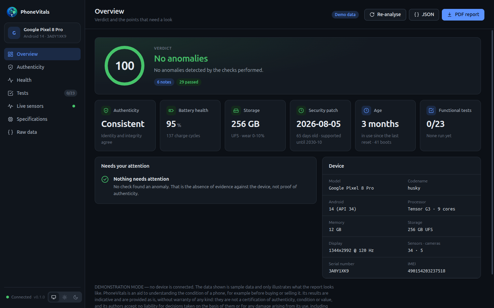
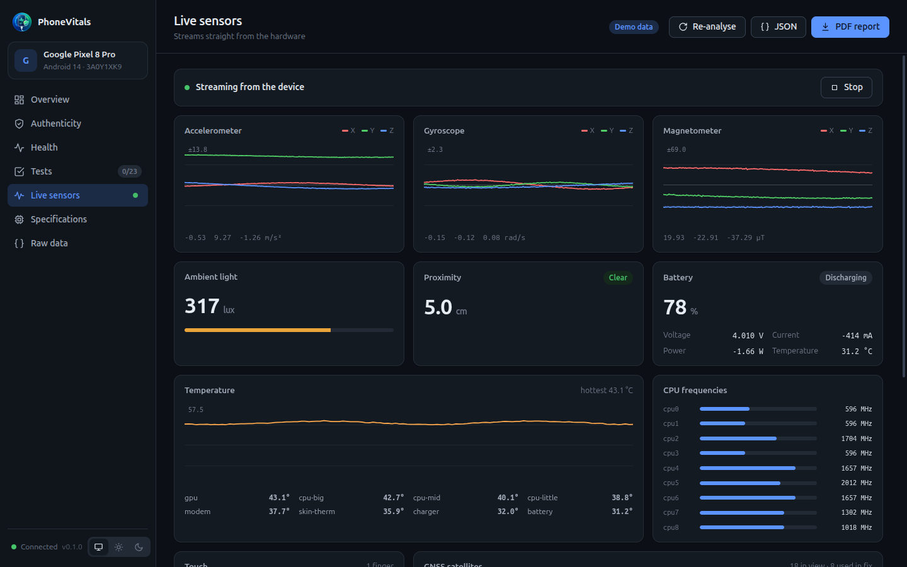
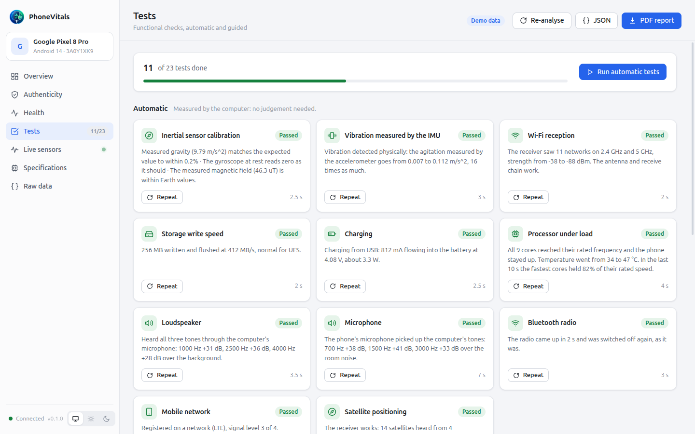
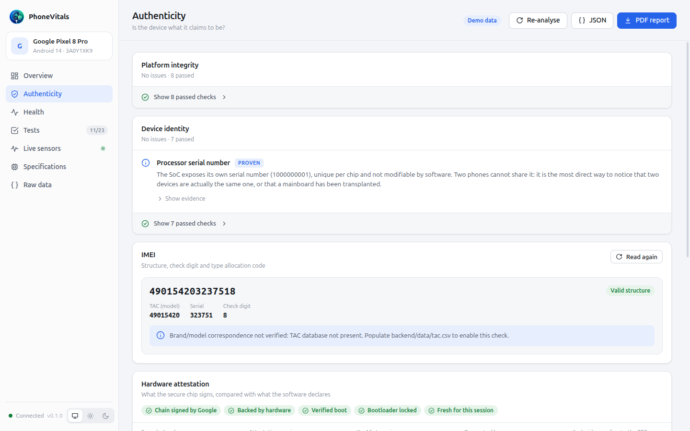
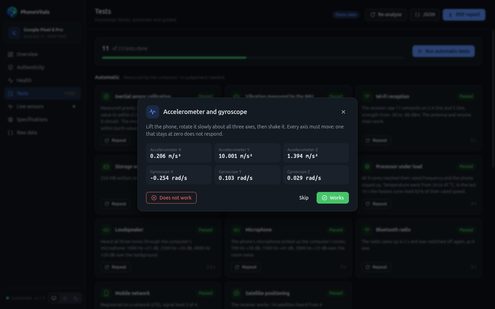

# PhoneVitals

Forensic analysis and diagnostics of Android devices connected over USB.
You open a page, plug in a phone, and the program does the rest: it collects
the specifications, verifies that the device is consistent with itself,
measures the condition of the components, and shows the sensors live.

```bash
sudo snap install phonevitals
sudo snap connect phonevitals:adb-support    # USB access, once
```

From a source checkout: `./run.sh` (see [Development](#development)).

> **Purpose and disclaimer.** PhoneVitals is a tool for understanding the
> condition of a phone better, for example before buying or selling it. Its
> results are indicative and are provided *as is*, without warranty of any
> kind. They are not a certification of authenticity, condition or value. The
> authors accept no liability for decisions taken on the basis of its results,
> or for any damage arising from its use, including from the functional tests
> (some heat the phone, make it vibrate or briefly change a setting). Every
> report, the PDF included, carries the same notice.



| | |
|---|---|
|  |  |
|  |  |

The screenshots come from demo mode: the device, IMEI and serial numbers are
simulated.

---

## What it does, and with how much certainty

The report separates its conclusions into three levels of evidential strength,
and this is the most important thing to understand in order to use it well.

**Proven.** Derived from arithmetic, or from a comparison between values that
must agree by construction. Depends on no database and is not a matter of
opinion.

- The IMEI check digit (Luhn algorithm). An IMEI that fails it was never
  assigned: it is made up.
- Agreement between the identities declared by the five Android partitions
  (system, vendor, odm, product, system_ext). Whoever rebrands a phone almost
  always modifies only `system`, which is what apps read, and leaves `vendor`
  and `odm` with the real manufacturer's data.
- Contradiction between the build fingerprint and the declared model.
- Verified Boot and bootloader state.
- The Knox fuse on Samsung devices, which is physical and irreversible.
- Hardware key attestation: what the secure environment signs, against what
  the software declares. The certificate chain is verified offline, signature
  by signature, up to Google's attestation roots, and checked against Google's
  list of revoked keys (both ship with the program).
- A different phone already seen with the same IMEI, and parts whose
  identifiers changed since a phone was last analysed here (see
  [Local memory](#local-memory-and-reference-units)).

**Measured.** The kernel reads the hardware and the result is compared against
an expected specification. Depends on how complete the catalogue is, so a
discrepancy is a suspicion to verify, not a verdict.

- Real cores, frequencies, cluster microarchitecture from `/proc/cpuinfo`.
- RAM and physical storage capacity, read from the kernel rather than from
  system properties, which clones inflate.
- Panel resolution and refresh rate.
- Battery health: cycles, remaining capacity against design capacity, cell
  manufacturing date, first-use date.
- Internal storage wear from the UFS health descriptor. Battery health is
  reported only when the device really measures it: a gauge that echoes the
  design capacity, or one with no charge history, gives "not measurable"
  rather than a reassuring 100%.
- Age and use: production month (Samsung serial numbers), first start after
  the last factory reset, boots since then, abnormal restarts, crashes and
  hardware errors in the system log.
- What stops a phone being sold or used: a Google account still signed in
  (Factory Reset Protection), a financing lock (Android Device Lock, Samsung
  Knox Guard), an organisation's device owner. Personal files left on the
  phone are counted, never opened.
- End of the manufacturer's security-update guarantee, for catalogued models.

**Circumstantial.** Usage statistics and absences. Directs a manual check;
never sufficient on its own.

### Functional tests

Automatic, measured without asking anyone: inertial sensors at rest,
vibration felt by the accelerometer, Wi-Fi reception, storage write speed,
charging current, all cores under 30 seconds of load, the loudspeaker heard by
the computer's microphone, the microphone hearing the computer's speakers,
Bluetooth radio, mobile network registration and GNSS satellites. "Run
automatic tests" runs them one after another, since several share the
sensors. A test that cannot decide (no SIM, no satellites indoors, battery
full) says *inconclusive*, never *failed*.

Guided, where a person has to look or act: a picture from every camera,
touch coverage and multitouch, screen colours, buttons, proximity, light,
compass, flash and vibration strengths.

### Reports

*PDF report* produces a printable summary for a customer or a buyer: verdict,
device, findings, tests, history and the photo of the IMEI dialog as
evidence. *JSON* exports everything collected. The PDF carries the SHA-256 of
the JSON export in canonical form (`json.dumps(report, sort_keys=True,
separators=(",", ":"), ensure_ascii=False)`), so the two can be matched and a
later edit shows.

**Bench mode** (Tests page) is for one phone after another: each phone is
analysed, every automatic test runs, the PDF and JSON are saved in a chosen
folder, and the next phone can be connected.

### Local memory and reference units

Every analysis is remembered on this computer, in
`~/.local/share/phonevitals/devices.db` (in the snap,
`~/snap/phonevitals/common/devices.db`), so that:

- an IMEI turning up again on a different device is reported, as cloned
  identities are;
- a phone that comes back is compared with its last analysis, and replaced
  camera modules, panel, battery or storage chip are named.

IMEIs, serial numbers and component identifiers are stored only as SHA-256
hashes salted with a random value created for this installation: equality can
be tested, the values cannot be read back. Delete the folder to forget
everything; `scripts/analyse_cli.py --no-memory` leaves it untouched.

A phone known to be genuine can be saved as the **reference unit** for its
model (Authenticity page). Later units of the same model are compared with it
trait by trait: processor, core layout and frequencies, resolution, camera
sensors, sensor chips. Differences in what genuine units share are reported
as warnings; in parts sourced from several suppliers, as notes.

### What it does not do

The program **never declares a device authentic**. The absence of anomalies is
not proof of authenticity: it is the absence of proof to the contrary.

It does not check whether an IMEI is reported stolen or blocked. That requires
querying national registries (GSMA Device Check, CEIR), which needs a
subscription.

It does not replace a physical inspection. A component replaced with an
identical original one leaves no trace in software.

---

## How it is built

```
run.sh                  launcher for a source checkout
backend/
  main.py               starts the local server
  requirements.txt      pinned Python dependencies
  phonevitals/
    adb.py              async layer over adb, batching and device watcher
    analyzer.py         orchestrator: from connection to report
    live.py             real-time streams (agent, touch, metrics)
    testsuite.py        automatic and guided functional tests
    server.py           WebSocket and local API
    store.py            local memory of analysed phones (hashed identifiers)
    demo.py             sample snapshot for --demo
    collectors/         data collection, one module per area
    analysis/           authenticity engine, IMEI, attestation, spec catalogue
  data/
    specs.json          catalogue of expected specifications (extensible)
    pvagent.dex         compiled on-device agent
  tests/                engine and attestation regression tests
agent/src/              Java source of the agent
ui/
  main.js               Electron main process
  preload.js            the page's only bridge to the desktop (save dialog)
  web/                  interface source (Svelte 5, built with Vite)
    src/lib/            connection, state, live canvases, report helpers
    src/views/          the dashboard pages
  dist/                 built interface, served by the backend (generated)
ui/build/               installer icon and electron-builder resources
snap/                   snapcraft packaging
.github/workflows/      CI and release automation
docs/screenshots/       store listing screenshots (demo data)
scripts/                setup, build, utilities
```

The backend is Python (FastAPI), the interface is a Svelte page served on
`127.0.0.1` and loaded inside an Electron window. It opens on an overview —
verdict, the findings that need a look, battery, storage, patch level and test
progress — with the details one click away in the sidebar: authenticity,
health, functional tests, live sensors, specifications and raw data. It
follows the desktop's light or dark theme, or the one picked in the sidebar. The backend binds a free
port chosen at startup and announces it on stdout, so it never collides with
another program or another instance.

Loopback is not a trust boundary: any web page open in a browser can send
requests to `127.0.0.1`, and WebSocket handshakes are not subject to CORS.
Because this socket can drive a phone, Electron generates a random token at
every launch; the first page load exchanges it for an HttpOnly, SameSite=Strict
cookie, and every API call and the WebSocket require it. The `Host` header is
checked too, which defeats DNS rebinding.

### The on-device agent

Sensors are not readable from the command line: no shell command returns
accelerometer or gyroscope values. A Java process with a Context is required.

PhoneVitals copies a 32 KB `.dex` file into `/data/local/tmp` and runs it with
`app_process`, the same mechanism scrcpy and Shizuku use. The process runs as
the shell user (UID 2000), exactly like any command launched from adb:

- it **installs no application**, does not appear among the apps, no icon;
- it **does not survive a reboot**;
- the file is removed when the session ends.

The agent provides accelerometer, gyroscope, magnetometer, ambient light,
proximity, barometer, gravity, linear acceleration, rotation vector and step
counter at roughly 60 Hz, GNSS satellites, hardware key attestation, and for
the tests: battery current and Android's battery facts, torch, test tones on
the loudspeaker, microphone recording, Bluetooth scanning and a still from
each camera. Recordings and pictures go to the computer only; nothing is
saved on the phone.

### Why the IMEI needs an unlocked screen

Up to Android 9, `service call iphonesubinfo 1` was enough. From Android 10 the
IMEI is protected by `READ_PRIVILEGED_PHONE_STATE`, a signature permission the
shell user does not hold: the call returns null. It cannot be worked around
without root.

What is *not* protected is the screen. The phone shows the IMEI to anyone
looking at it, and `uiautomator` reads the view tree including the texts.
PhoneVitals types `*#06#` on the dialpad and reads the dialog that pops up: the
same information an operator would read off the display, automated. Two
physical requirements remain that no software can remove — the screen must be
on and unlocked.

The code has to be *typed*. The dialer recognises MMI sequences from a
TextWatcher on its input field, so a number placed there by an intent does not
trigger it: `ACTION_DIAL` only prefills the field, and `ACTION_CALL` hands
`*#06#` to the network, which answers "invalid MMI code". Sending the digits as
key events makes the dialer react exactly as it would to a finger.

Walking Settings is kept as a fallback, for skins that swallow the MMI code.
It is the slower route: it depends on matching menu labels in the phone's
interface language, and on Pixel it does not work at all. The Settings
device-info screens there keep emitting UI events, so `uiautomator` never
reaches the idle state it insists on before dumping — and it reports that
failure on stdout while still exiting 0, so the exit status cannot be trusted.

One exception: where the device attests its identifiers in hardware, the IMEI
arrives signed by the secure environment and needs no unlocked screen at all.
This is optional and many manufacturers do not enable it.

---

## Installation

| System | Package | adb |
|---|---|---|
| Ubuntu and other snap distributions | `sudo snap install phonevitals` | included |
| Debian, Ubuntu (x64, arm64) | `PhoneVitals-<version>-linux-<arch>.deb` | installed as a dependency |
| macOS (Apple Silicon, Intel) | `PhoneVitals-<version>-mac-<arch>.dmg` | `brew install android-platform-tools` |
| Windows (x64) | `PhoneVitals-<version>-win-x64.exe` | `winget install Google.PlatformTools` |

Installers are attached to every GitHub release. They are not code-signed
yet: on first launch macOS asks to confirm in System Settings › Privacy &
Security, and Windows SmartScreen asks to "Run anyway". On Windows, some phones
also need their manufacturer's USB driver (Samsung, Xiaomi...) for adb to see
them; Pixel works with the driver Windows installs by itself.

### Snap

```bash
sudo snap install phonevitals
sudo snap connect phonevitals:adb-support
```

`adb-support` gives the snap access to Android devices on USB and installs
the matching udev rules; snapd does not connect it automatically. The
automatic loudspeaker test also needs `sudo snap connect
phonevitals:audio-record`, to listen through the computer's microphone. The snap
ships its own adb, so the phone asks once to authorise this computer again
even if it already trusts the system adb.

adb clients and servers of different versions restart each other. If
another adb server is running on the machine (Android Studio, a system
`adb`), stop it with `adb kill-server` before starting PhoneVitals.

Reports are saved through the system file dialog, to any location.

### Preparing the phone

1. **Developer options** — Settings › About phone › tap *Build number* seven
   times.
2. **USB debugging** — Settings › System › Developer options › enable
   *USB debugging*.
3. **Authorise the computer** — on connection a dialog asks "Allow USB
   debugging?". Tap *Allow*.
4. **Unlocked screen** — only for reading the IMEI.

Nothing else. No root is needed, and the bootloader must not be unlocked — on
the contrary, unlocking it would destroy the very integrity evidence the
program verifies.

---

## Development

Everything lives inside the project folder; the only system change is an
optional udev rule.

```bash
./scripts/setup_toolchain.sh            # adb, node, jdk, android sdk, python venv
./scripts/build_agent.sh                # compiles the .dex agent
(cd ui && PATH=../.toolchain/node/bin:$PATH npm ci)   # Electron, Svelte, Vite
sudo ./scripts/install_udev_rules.sh    # optional, for USB permissions
./run.sh                                # add --dev for the developer tools
```

`run.sh` rebuilds the interface when its sources changed. To work on it with
hot reload, start a backend and the Vite dev server side by side:

```bash
.toolchain/venv/bin/python backend/main.py --demo --port 8731   # prints its URL
(cd ui && npm run dev:web)
```

Open the backend's printed URL once, which stores the session cookie, then
http://127.0.0.1:5173. Cookies are per host, not per port, so the dev server's
proxied requests carry it.

To uninstall: `rm -rf` the folder, plus
`/etc/udev/rules.d/51-android-phonevitals.rules` if it was installed.

The compiled agent `backend/data/pvagent.dex` is committed: rebuild it with
`scripts/build_agent.sh` after changing `agent/src`. A source checkout needs
Node 22 or later; `setup_toolchain.sh` downloads one if the system's is older.

### Command line

The same pipeline as the GUI, useful for scripting and diagnostics:

```bash
.toolchain/venv/bin/python scripts/analyse_cli.py
.toolchain/venv/bin/python scripts/analyse_cli.py --no-imei --json report.json
```

### Without a phone

```bash
.toolchain/venv/bin/python backend/main.py --demo   # prints the URL to open
./scripts/smoke_backend.sh --demo                   # endpoint and auth checks
./scripts/screenshot_demo.sh                        # captures every page
./scripts/store_screenshots.sh                      # the five store screenshots
```

### Building the installers

```bash
.toolchain/venv/bin/python -m pip install pyinstaller==6.22.3
.toolchain/venv/bin/python scripts/build_backend.py   # self-contained backend
(cd ui && npm run dist)                               # installer for this system
```

PyInstaller does not cross-compile: each installer is built on its own system,
which is what `.github/workflows/build.yml` does on GitHub's runners.

### Building the snap

```bash
snapcraft pack
sudo snap install --dangerous ./phonevitals_*.snap
sudo snap connect phonevitals:adb-support
```

## Releasing

Every push to `main` and every pull request runs the tests, builds the
interface and builds the snap (`.github/workflows/ci.yml`; the `.snap` is kept
as a workflow artifact). Every push to `main` also builds the desktop
installers (`.github/workflows/build.yml`: `.dmg` for Apple Silicon and Intel,
`.exe` for Windows, `.deb` for x64 and arm64), and a published release gets
them attached.

### Versions

The version lives in one place, the `VERSION` file, and follows semantic
versioning (until 1.0.0 the report format may still change between minor
versions). The backend, the interface (`/api/health`, the sidebar, the PDF) and
`--version` of the command-line tools read it; the snap is built with it. CI
fails if `ui/package.json` or `CHANGELOG.md` disagree with it.

```bash
./scripts/bump_version.sh minor     # or patch, major, or an explicit 0.3.0
```

updates `VERSION`, `ui/package.json` and its lock file, and moves the
"Unreleased" notes of `CHANGELOG.md` under the new version. Builds that are not
on the release tag get the commit appended (`0.2.0+git.1a2b3c4`), so an edge
build never passes for a release.

To release:

1. Bump, commit, then tag and publish a GitHub release named `v<VERSION>`,
   e.g. `v0.2.0`; the workflow refuses a tag that does not match `VERSION`.
2. `.github/workflows/release.yml` builds the snap from the tag, uploads it to
   the Snap Store — to `stable`, or to `candidate` for a pre-release — and
   attaches the `.snap` to the release.

The workflow needs one repository secret, `SNAPCRAFT_STORE_CREDENTIALS`:

```bash
snapcraft export-login --snaps=phonevitals \
  --acls package_access,package_push,package_update,package_release -
```

Connecting the repository on snapcraft.io (Builds tab) adds builds of every
push to `main`, released to `edge`. The two coexist: `edge` follows the
branch, `candidate` and `stable` follow the releases.

Store listing screenshots are in `docs/screenshots`; regenerate them after
interface changes with `./scripts/store_screenshots.sh` (demo data only).

---

## Extending the specification catalogue

`backend/data/specs.json` holds the expected specifications per model. A
missing entry produces no verdict, only a note: the other checks do not depend
on the catalogue.

```json
{
  "name": "Commercial name",
  "brand": "brand",
  "devices": ["codename"],
  "models": ["SM-XXXX"],
  "soc": "commercial chip name",
  "soc_ids": ["technical-part-number"],
  "cpu_cores": 8,
  "ram_gb": [8, 12],
  "storage_gb": [128, 256],
  "resolution": {"width": 1080, "height": 2400},
  "max_refresh_hz": 120,
  "confidence": "high"
}
```

Two lessons learned in the field:

`soc_ids` must contain the **technical part numbers**, not the commercial
name. A Snapdragon 730 presents itself to the system as `SM7150` on platform
`sm6150`: searching for the word "Snapdragon" would raise a false alarm on
every Qualcomm device.

Omit fields that vary by market. The Galaxy S24 has a 10-core Exynos 2400 in
Europe and an 8-core Snapdragon 8 Gen 3 elsewhere: declaring `cpu_cores` would
flag it as anomalous in half the world.

### TAC database

The correspondence between TAC (the first 8 digits of the IMEI) and
brand/model is a table assigned by the GSMA and cannot be derived by
computation. If `backend/data/tac.csv` does not exist, the program says so
explicitly instead of guessing: an invented match would produce false
counterfeit alarms, which is the most damaging possible error.

Expected format: `tac,brand,model,name`.

### Attestation roots and revocations

`backend/data/attestation_roots.pem` holds Google's hardware attestation roots
and `backend/data/attestation_status.json` Google's list of revoked
attestation keys. With them every attestation chain is verified offline:
each signature, up to a Google root, and no revoked key on the way. Both are
public and change rarely; `scripts/update_attestation_data.sh` refreshes
them, and the release workflow runs it before every build.

---

## Tests

```bash
cd backend
../.toolchain/venv/bin/python tests/test_engine.py
../.toolchain/venv/bin/python tests/test_attestation.py
../.toolchain/venv/bin/python tests/test_collectors.py
../.toolchain/venv/bin/python tests/test_store.py
```

`test_store.py` covers the local memory, including that no identifier is
stored in clear.

`test_engine.py` runs whole snapshots through the authenticity engine: a
consistent device (must produce zero serious anomalies), a rebranded clone
(every rule must fire), and regression cases that earlier versions of the
engine reported as counterfeit — a legitimately upgraded Treble device, a
stock Pixel whose system partition carries a generic Treble fingerprint, a
dual-SIM handset holding two IMEIs — plus a clone that is perfectly consistent
in software but contradicted by the TEE.

`test_attestation.py` parses attestation certificates, and
`test_collectors.py` feeds real-world output shapes (dumpsys, sysfs, getevent,
camera metadata) to the collectors' parsers.

---

## Notes on technical choices

**Why batching, and why concurrent.** A full analysis performs over a hundred
reads on the device. One at a time that is as many USB round-trips, i.e. tens
of seconds. `Adb.batch()` groups them into single `adb shell` invocations,
separating the outputs with unique markers, and dispatches those batches
concurrently — adb multiplexes several shell channels over one USB connection.

**Why one grep instead of many cats.** Reading sysfs with a `cat` per file is
dominated by process spawn cost, not by the driver. On a Pixel the battery
`power_supply` directory holds ~120 nodes: a per-file loop took 15.9 s, while a
single `grep` over the same files took 0.25 s and returned identical values.
The same applies to CPU frequencies and thermal zones. A full analysis went
from 37.7 s to about 5 s.

**Why the charts are drawn by hand.** With twelve series updating at 50 Hz a
generic charting library would cost more than it is worth: a line chart over a
ring buffer is fifty lines of code. The live views keep collecting while their
page is hidden and draw on demand, one animation frame for all of them, so
switching to Live sensors shows the recent past immediately. Readouts are
published to the reactive state a few times a second, which is all a number
on screen needs.

**Why no verdict without data.** Every rule that depends on an external source
declares its own level of reliability, and in the absence of that source it
stays silent rather than guessing. A false counterfeit alarm is more damaging
than a missed anomaly: it makes a good device get rejected and destroys trust
in the tool.

**Why several IMEIs are not an anomaly.** A dual-SIM handset, or one with an
eSIM, is assigned one IMEI per radio stack by design, so finding more than one
is expected and is never reported as a finding. Their sharing a TAC is a
convention, not a rule the GSMA enforces — a manufacturer holding several
blocks may allocate the second IMEI from another one — so a mismatch there is
raised as something to check, not as proof of a rewrite. Only the Luhn check
stays critical, because it is arithmetic. Findings of this kind are also
evaluated once per distinct TAC rather than once per IMEI: the verdict is
decided by counting findings by severity, and a single fact reported twice
pushed a dual-SIM phone towards "compromised" with double the weight it
deserved.

**Why placeholders are not identities.** A stock Pixel declares
`model = "Generic System"` in the system partition while vendor, odm and
product say "Pixel 8", and its system fingerprint reads
`Android/generic_system/generic:...`. This is the separation Project Treble
intends. Comparing those placeholders against the real model reproduces
exactly the counterfeit pattern on a perfectly authentic phone, so the engine
filters them out before every identity comparison.
